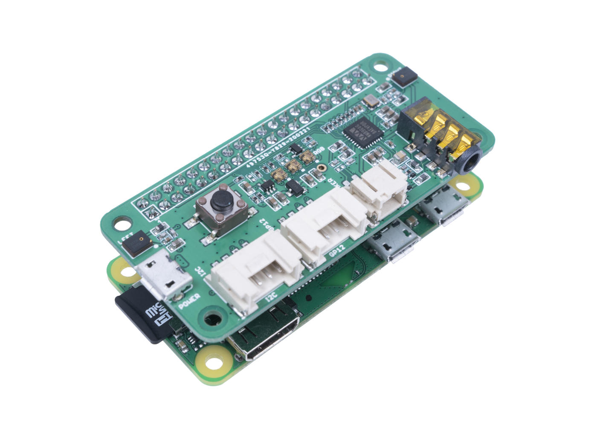

# rpi-voice-assistant
A Raspberry Pi based voice assistant running logic on Voiceflow


## Preparation

### Hardware
You must have a Python3-enabled system with audio input/output capability.
The audio capture device must be capable of capturing at 16Khz.



### System dependencies
This application requires the `PyAudio` package that has system dependencies:
```bash
sudo apt-get install -y python3 python3-pip python3-all-dev python3-pyaudio portaudio19-dev libsndfile1 mpg123
```

### Python dependencies
Python dependencies can be installed with the following command:
```bash
pip3 install -r requirements.txt
```

### GCP Account
The RPI voice assistant requires Google Speech-to-text API access.
Make sure that your user/service account has the correct access permissions.
Setup instructions can be found on the [official guide](https://cloud.google.com/speech-to-text/docs/libraries).
The gc.json file content should be replaced with your credentials.

### App configuration
The Voiceflow project API key must be specified in the config.yaml file as `vf_APIKey`. You can learn more about Voiceflow API keys and how to generate them [here](https://www.voiceflow.com/blog/voiceflow-api).

To run the application, you must specify the following in the `config.yaml`:
| Parameter | Purpose |
| --------- | ------- |
| vf_VersionID | The Voiceflow runnable version ID of your target skill |
| vf_APIKey | The Voiceflow project API key |
| wakeword | A list of `porcupine`-supported wake word(s) that can be used to invoke the system |
| accesskey | You Porcupine access key available [here](https://picovoice.ai/docs/quick-start/console-access-key/) |

## Usage
Run
```bash
./start.sh
```

### Extra
If you want to auto start the script on boot, edit your `.bashrc` file and add this to the bottom:
```bash
# Launching VF Assistant
cd rpi-voice-assistant
bash start.sh
```

To use your own custom wakeword, you can create one from the [Procupine Console](https://console.picovoice.ai) and uncomment the script in `main.py`


